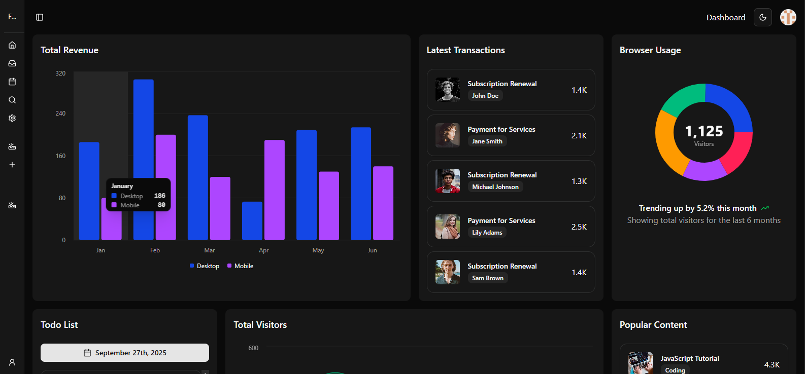
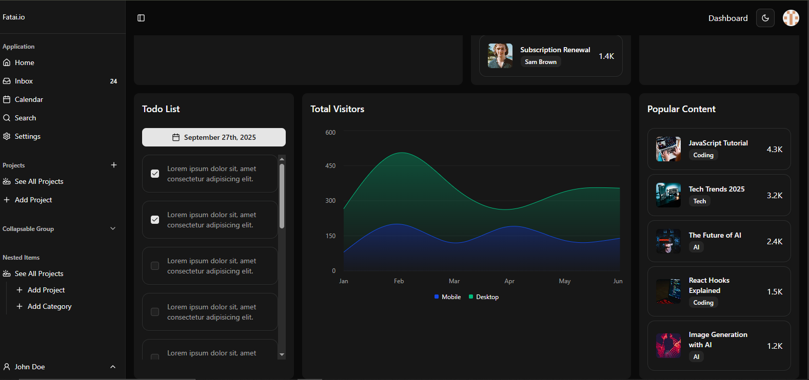

# 📊 Modern Dashboard

[](https://nextjs.org/)
[](https://react.dev/)
[](https://tailwindcss.com/)
[](https://vercel.com/)

A sleek, **modern dashboard UI** built with **Next.js, React, TailwindCSS, and ShadCN UI**, featuring charts, tables, statistics, and a responsive sidebar layout.

🔗 **Live Demo:** [modern-dashbaord.vercel.app](https://modern-dashbaord.vercel.app/)

---

## ✨ Features

- 📱 **Responsive Layout** — works seamlessly on desktop, tablet, and mobile
- 🎨 **ShadCN UI Components** — clean and reusable UI building blocks
- 📊 **Interactive Charts** — visualize data (revenues, usage trends, etc.)
- 📋 **Data Tables & Lists** — recent transactions, activities, to-do list
- 🌙 **Theming** — light & dark mode support
- 🧩 **Modular Components** — sidebar, header, cards, widgets
- ⚡ **Deployed with Vercel** — easy CI/CD from GitHub

---

## 🛠 Tech Stack

- **Framework**: [Next.js](https://nextjs.org/)
- **UI**: [ShadCN UI](https://ui.shadcn.com/) + [Tailwind CSS](https://tailwindcss.com/)
- **Charts**: (e.g. [Recharts](https://recharts.org/) / [ApexCharts](https://apexcharts.com/))
- **Icons**: [Lucide React](https://lucide.dev/)
- **Deployment**: [Vercel](https://vercel.com/)

---

## 📷 Screenshots

### Dashboard Preview



### Dark Mode



---

## 🚀 Getting Started

### 📌 Prerequisites

- [Node.js](https://nodejs.org/) (>= 16.x recommended)
- npm or yarn

### ⚙️ Installation

```bash
# Clone this repository
git clone https://github.com/yourusername/modern-dashboard.git
cd modern-dashboard

# Install dependencies
npm install
# or
yarn install
```
